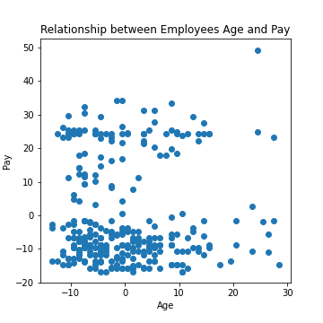
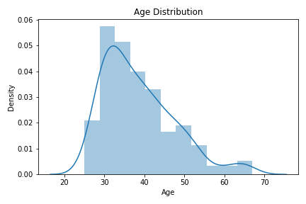
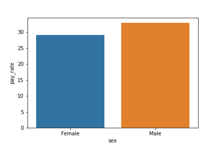
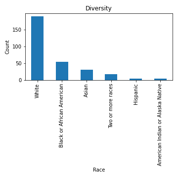
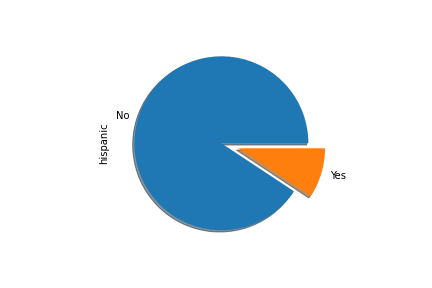
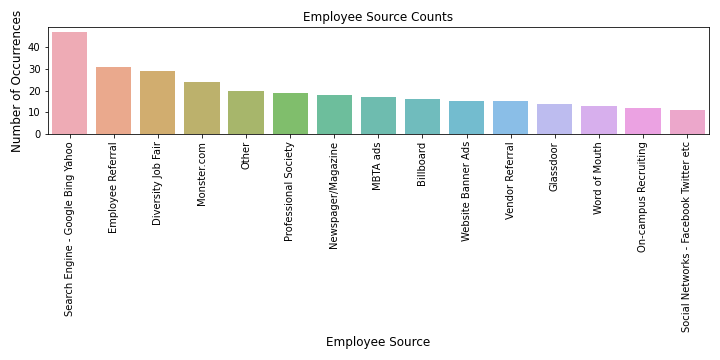
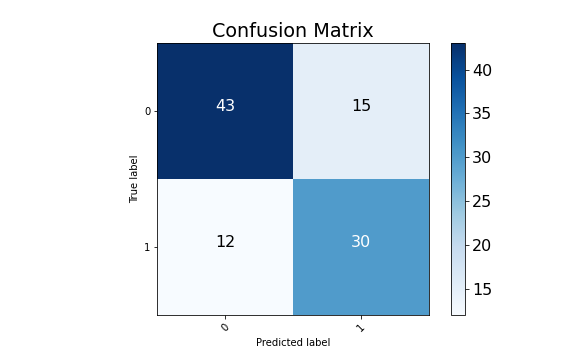

# HR_project

The dataset source https://www.kaggle.com/rhuebner/human-resources-data-set

The data revolves around a company called Dental Magic, and the core data set contains names, DOBs, age, gender, marital status, date of hire, reasons for termination, department, whether they are active or terminated, position title, pay rate, manager name, and performance score.

As an outside data consultant, Dental Magic has asked me to provide analysis to the following open ended questions:

**1. Is there any relationship between age and how much an employee paid?**

No, there is no positive or negative correlation between age and pay.

**2. Is there any relationship between who a person works for and their performance score?**

In the visualization you can see that many managers at Dental Magic have employees working under that that "fully meet" their employee scores. There isn't much of a relationship between who a person works for and their performance score. Although there are some points worth discussing:
 - Brandon Miller frequently has employees who exceed expectations with their employee score.
 - Michael Albert has several newer employees reporting to him and additional employees who need improvement.  

**3. What is the overall diversity profile of the organization?**

- Age is a big indicator with diversity within an organization. In this company, age is distributed pretty evenly throughout the organization.

- Sex/Gender is another factor to consider when evaluating diversity. The graph below sums the pay of males vs females for gender equality measures.

- Race is split into 6 categories within the oranization. This seems to be the least dispersed diversity measure. There are significantly more 'White' employees within the organization than Non-White.

**4. What are our best recruiting sources if we want to ensure a diverse organization?**
One of the top 3 recruiting sources are from a diversity job fair so this is one way you can ensure for future diversity.

**5. Can we predict who is going to terminate and who isn't? What level of accuracy can we achieve on this?**

Yes, we can use logistic regression in order to predict if the employee will be terminated. In our Jupyter notebook you will see that we categorized the data to be 1-employed or 0-terminated.

We fit a logistic regression model using Scikit-Learn.

- Our first model was not bad, our classifier was about 81% accurate on our training data and about about 70% accurate on our test data!  

- We used ***SMOTE*** - Synthetic Minority Oversampling Technique which uses a nearest neighbors algorithm to generate new and synthetic data we can use for training our model.

Logistic Regression Evaluation:
- Training Precision:  0.79
- Testing Precision:  0.63
- Training Recall:  0.80
- Testing Recall:  0.74
- Training Accuracy:  0.79
- Testing Accuracy:  0.71
- Training F1-Score:  0.80
- Testing F1-Score:  0.68
